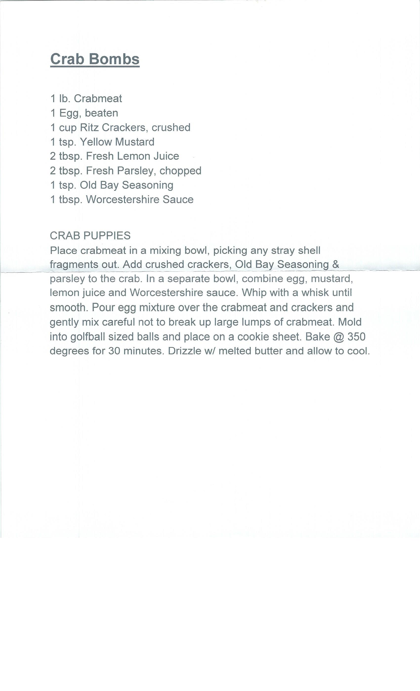

---
title: CRAB BOMBS
sidebar_label: CRAB BOMBS
---

# CRAB BOMBS
1 lb. Crabmeat
1 Egg, beaten
1 cup Ritz Crackers, crushed
1 tsp. Yellow Mustard
2 tbsp. Fresh Lemon Juice
2 tbsp. Fresh Parsley, chopped
1 tsp. Old Bay Seasoning
1 tbsp. Worcestershire Sauce

CRAB PUPPIES
Place crabmeat in a mixing bowl, picking any stray shell fragments out. Add crushed crackers, Old Bay Seasoning & parsley to the crab. In a separate bowl, combine egg, mustard, lemon juice and Worcestershire sauce. Whip with a whisk until smooth. Pour egg mixture over the crabmeat and crackers and gently mix careful not to break up large lumps of crabmeat. Mold into golfball sized balls and place on a cookie sheet. Bake @ 350 degrees for 30 minutes. Drizzle w/ melted butter and allow to cool.

:::note
This recipe page was auto-generated for the file crab-bombs.docx.
:::

