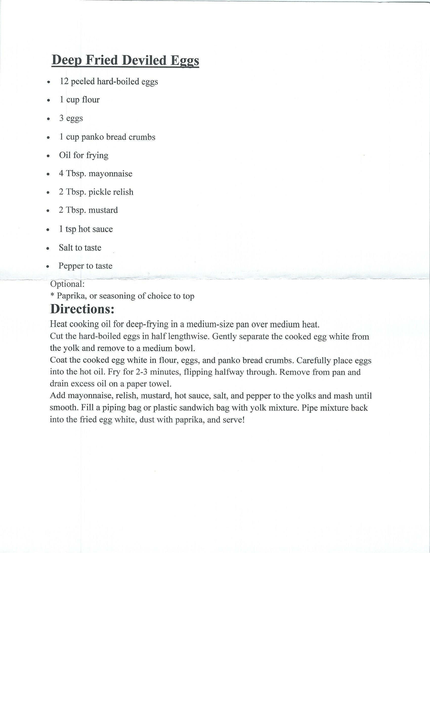

---
title: DEEP FRIED DEVILED EGGS
sidebar_label: DEEP FRIED DEVILED EGGS
---

# DEEP FRIED DEVILED EGGS

Deep Fried Deviled Eggs
•	12 peeled hard-boiled eggs
•	1 cup flour
•	3 eggs
•	1 cup panko bread crumbs
•	Oil for frying
•	4 Tbsp. mayonnaise
•	2 Tbsp. pickle relish
•	2 Tbsp. mustard
•	1 tsp hot sauce
•	Salt to taste
•	Pepper to taste
Optional:
* Paprika, or seasoning of choice to top
Directions:
Heat cooking oil for deep-frying in a medium-size pan over medium heat.
Cut the hard-boiled eggs in half lengthwise. Gently separate the cooked egg white from the yolk and remove to a medium bowl.
Coat the cooked egg white in flour, eggs, and panko bread crumbs. Carefully place eggs into the hot oil. Fry for 2-3 minutes, flipping halfway through. Remove from pan and drain excess oil on a paper towel.
Add mayonnaise, relish, mustard, hot sauce, salt, and pepper to the yolks and mash until smooth. Fill a piping bag or plastic sandwich bag with yolk mixture. Pipe mixture back into the fried egg white, dust with paprika, and serve!

