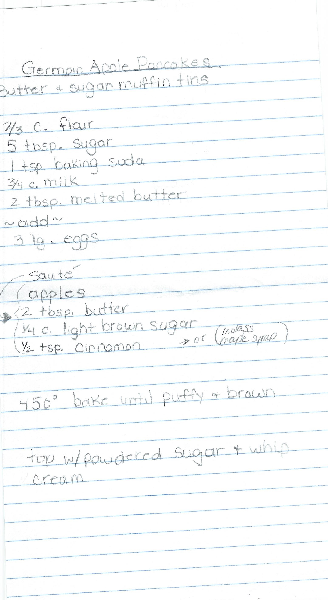

---
title: GERMAN APPLE PANCAKES
sidebar_label: GERMAN APPLE PANCAKES
---

# GERMAN APPLE PANCAKES
GERMAN APPLE PANCAKES

In iron skillet, saute:
2 tbsp. Butter
1 Granny Smith (peeled & sliced ¼” thick)
1 tbsp. Brown Sugar
3/4 tsp. Cinnamon
Cook for 5 minutes. Remove apples. Wipe skillet clean.

In a bowl combine:
¾ c. Flour
3 tbsp. Sugar
3 large room temperature Eggs
¾ c. warm whole Milk
Stir.

In iron skillet:
2 tbsp. Butter
Add Caramelized Apples 
Pour Batter On Top

Preheat oven to 425 degrees. Bake for 18 – 20 minutes.

