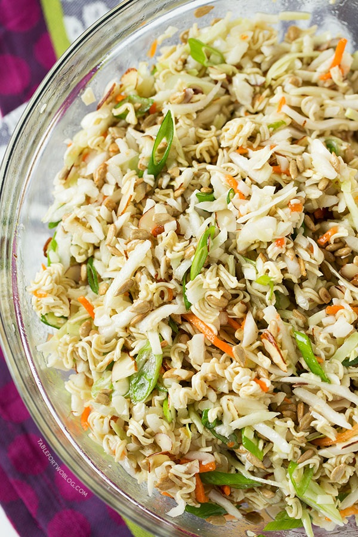

---
title: ASIAN RAMEN SALAD
sidebar_label: ASIAN RAMEN SALAD
---

# ASIAN RAMEN SALAD
Ridiculously Amazing Asian Ramen Salad
Author: Julie Wampler
Recipe type: Appetizer, Salad
Serves: 8-10
Ingredients:
1 (16 ounce) bag coleslaw mix
1 cup sunflower seeds (de-shelled/shelled/no shells)
1 cup Diamond of California sliced almonds
2 (3 ounce) bags ramen* (any flavor, you won't be using the
seasoning packets so it doesn't matter)
5 stalks of scallions, sliced
¾ cup vegetable oil
⅓ cup white vinegar
½ cup granulated sugar
Instructions:
1. In a large bowl, place coleslaw mix, sunflower seeds, sliced almonds, crushed ramen (see
note below), and scallions.
2. In a large measuring cup, add vegetable oil, vinegar, and sugar. Whisk together. Don't
worry if the sugar will not completely dissolve.
3. Pour oil mixture over the coleslaw mix and toss everything together with a large spatula
until everything is coated well.
4. Cover bowl with plastic wrap and chill in refrigerator for at least 2 hours.
5. Serve cold or room temperature.
Notes:
To crush ramen, place ramen block into a Ziploc bag and using a rolling pin, gently crush
the ramen into smaller pieces.
I personally didn't add the seasoning packets because I don't like the MSG/sodium content
in ramen seasoning packets. However, I know this is a popular recipe and there are MANY
variations of it. So, it's all up to preference on whether or not you want to add the
seasoning packets, or anything else to this salad! :)
Recipe by Table for Two at http://www.tablefortwoblog.com/ridiculously-amazing-asian-ramen-salad/

:::note
This recipe page was auto-generated for the file asian-ramen-salad.pdf.
:::

