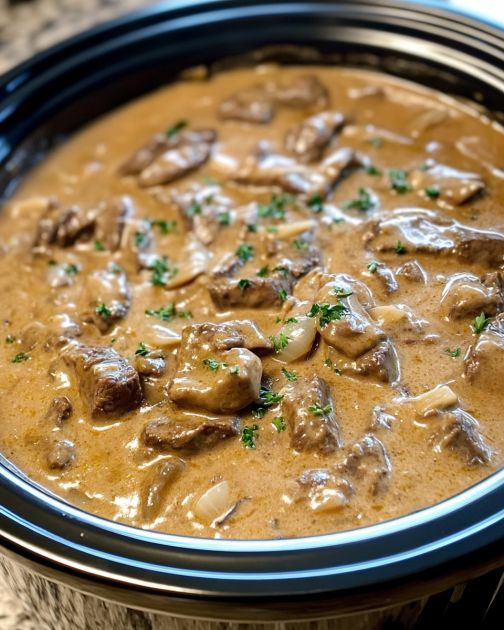

---
title: BEEF STROGANOFF PASTA
---

# 🍲 Slow Cooker 4‑Ingredient Beef Stroganoff Pasta

A simple, cozy, “comfort in a bowl” classic. With only four ingredients, this slow cooker stroganoff tastes like a gourmet dish without any effort.

---

## 🧂 Ingredients
- 1 pound beef stew meat  
- 1 can (10.5 oz) cream of mushroom soup  
- 1 cup sour cream  
- 8 oz egg noodles  

---

## 🥣 Directions
1. Place the beef stew meat in the slow cooker.  
2. Add the cream of mushroom soup and sour cream, stirring to combine.  
3. Cover and cook on **LOW for 6–8 hours**, or until the beef is tender.  
4. About 20 minutes before serving, cook the egg noodles according to package instructions.  
5. Stir the cooked noodles into the beef mixture in the slow cooker.  
6. Serve hot. Garnish with fresh parsley if desired.  

---

## 💡 Variations & Tips
- Add a splash of **Worcestershire sauce** or **1 teaspoon Dijon mustard** for richer flavor.  
- Swap cream of mushroom soup for **cream of chicken** if preferred.  
- For a lighter version, use **Greek yogurt** instead of sour cream.  
- Sautéed mushrooms or onions make great add‑ins for extra flavor and texture.  
- Serve with a green salad, steamed broccoli, or crusty bread to soak up the sauce.  

---

*Adapted from CooktopCove.*
**Source:**  
https://cooktopcove.com/2024/11/10/this-is-comfort-in-a-bowl-only-4-ingredients-and-every-time-i-make-it-they-think-its-a-gourmet-masterpiece/?src=fbfan_85363&t=fbsub_slowcookerkitchen_xp

