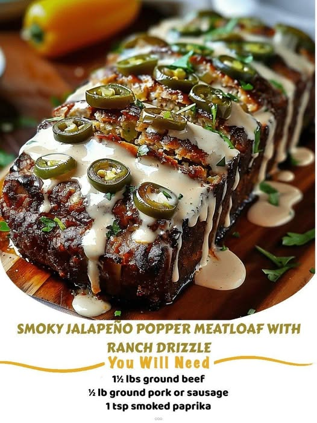

---
title: SMOKY JALAPEÑO POPPER MEATLOAF WITH RANCH DRIZZLE
sidebar_label: SMOKY JALAPEÑO POPPER MEATLOAF WITH RANCH DRIZZLE
---
# 🔥 SMOKY JALAPEÑO POPPER MEATLOAF WITH RANCH DRIZZLE
Bold meatloaf with a hidden jalapeño popper center of cream cheese, cheddar, and bacon — finished with a cool ranch drizzle.

---

# 🛒 Ingredients

### ➤ Meatloaf Base
- 1½ pounds ground beef  
- ½ pound ground pork or sausage  
- 1 teaspoon smoked paprika  
- ½ teaspoon garlic powder  
- ½ teaspoon onion powder  
- Salt and pepper to taste  
- 1 cup breadcrumbs  
- 2 large eggs  

### ➤ Cheesy Jalapeño Center
- 2 jalapeños, finely chopped (remove seeds for less heat)  
- 4 ounces cream cheese, softened  
- 1 cup shredded cheddar cheese  
- ½ cup cooked bacon, crumbled  

### ➤ Cool Ranch Drizzle
- ¼ cup ranch dressing  
- 2 tablespoons sour cream  
- Optional: splash of lime juice or fresh herbs  

---

# 🥣 Steps

**01** — Preheat oven to **375°F**. Line a loaf pan with parchment paper or grease well.  
**02** — In a large bowl, gently combine ground beef, ground pork, smoked paprika, garlic powder, onion powder, breadcrumbs, eggs, salt, and pepper. Avoid overmixing.  
**03** — In a separate bowl, mix cream cheese, cheddar, jalapeños, and bacon to create the filling.  
**04** — Press half the meat mixture into the loaf pan. Spread the jalapeño filling over it, then top with the remaining meat. Seal the edges.  
**05** — Bake for **45–55 minutes**, or until the internal temperature reaches **160°F**. Let rest for **10 minutes** before slicing.  
**06** — While resting, whisk together ranch dressing, sour cream, and optional lime juice. Drizzle over each slice before serving.  

---

# 💡 Tips

- This meatloaf is basically a jalapeño popper wrapped in comfort food — the creamy, spicy center is a game‑changer.  
- Great for meal prep — leftovers reheat beautifully.  
- Don’t skip the resting time; it keeps the meatloaf juicy and tender.  

---

Source:  
https://lilicooks.com/recipes/smoky-jalapeno-popper-meatloaf