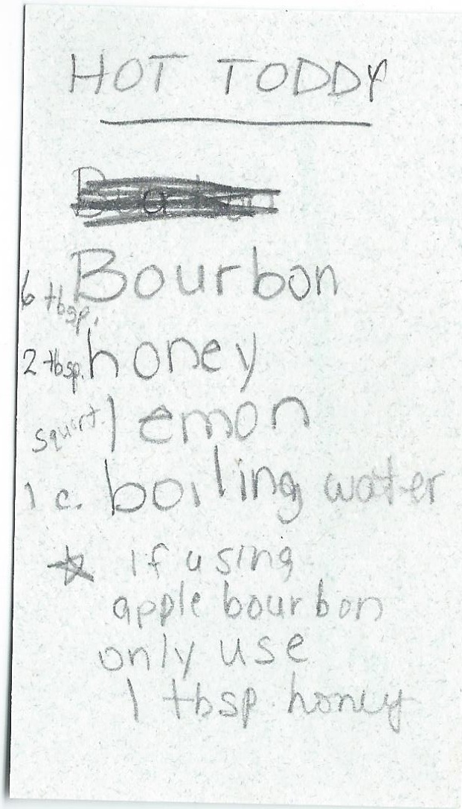

---
title: Hot Toddy
sidebar_label: Hot Toddy
slug: /hot-toddy
---

## Hot Toddy

**Ready in:** [Insert Time]
**Serves:** [Insert Servings]

### Ingredients
# Hot Toddy
## Ingredients
- 6 tbsp bourbon  
- 2 tbsp honey  
- Lemon (a squirt)  
- 1 cup boiling water  

### Notes
- If using apple bourbon, only use **1 tbsp honey**

### Preparation
1. Follow the mixing instructions provided in the source.

---

