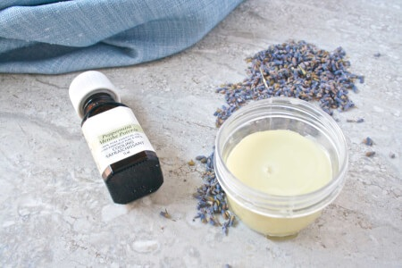

---
title: HEADACHE BANISHING_BALM (1)
sidebar_label: HEADACHE BANISHING_BALM (1)
---

# HEADACHE BANISHING_BALM (1)

Headache-Banishing Balm
Recipe by Melanie Richard Maxwell from Joyous Health
Ingredients:
1oz of carrier oil (almond, grapeseed,
avocado, or fractionated coconut oil are
all good options)
0.5oz beeswax
6 drops of lavender essential oil
20 drops of peppermint essential oil
Instructions:
1. In a double-boiler, or a heat-safe bowl placed on top of a pot of boiling water, heat together
the beeswax and carrier oil until fully melted. Remove from the heat and whisk in the
essential oils.
2. Quickly pour into a clean container. You can use anything that will hold about 2
tablespoons of liquid; a recycled baby food jar or a couple lip balm tubes work well. Let it
cool until completely solidified.
3. To use, rub your finger on the balm then massage onto your temples. If you used a lip
balm tube, you can apply the balm directly. You'll feel a cooling sensation that will help
soothe your headache pain. Rub temples as needed to reactivate the balm.
Joyous Health

