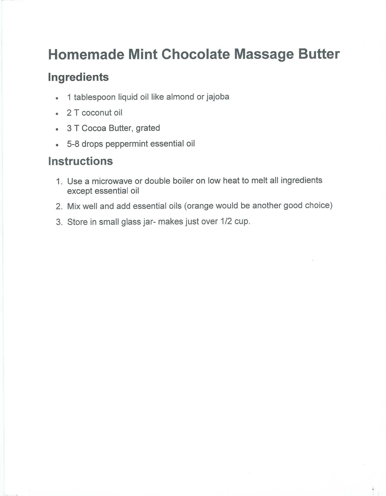

---
title: MINT CHOCOLATE MASSAGE BUTTER
sidebar_label: MINT CHOCOLATE MASSAGE BUTTER
---

# MINT CHOCOLATE MASSAGE BUTTER

Homemade Mint Chocolate Massage Butter
Ingredients
•	1 tablespoon liquid oil like almond or jajoba
•	2 T coconut oil
•	3 T Cocoa Butter, grated
•	5-8 drops peppermint essential oil
Instructions
1.	Use a microwave or double boiler on low heat to melt all ingredients except essential oil
2.	Mix well and add essential oils (orange would be another good choice)
3.	Store in small glass jar- makes just over 1/2 cup.

