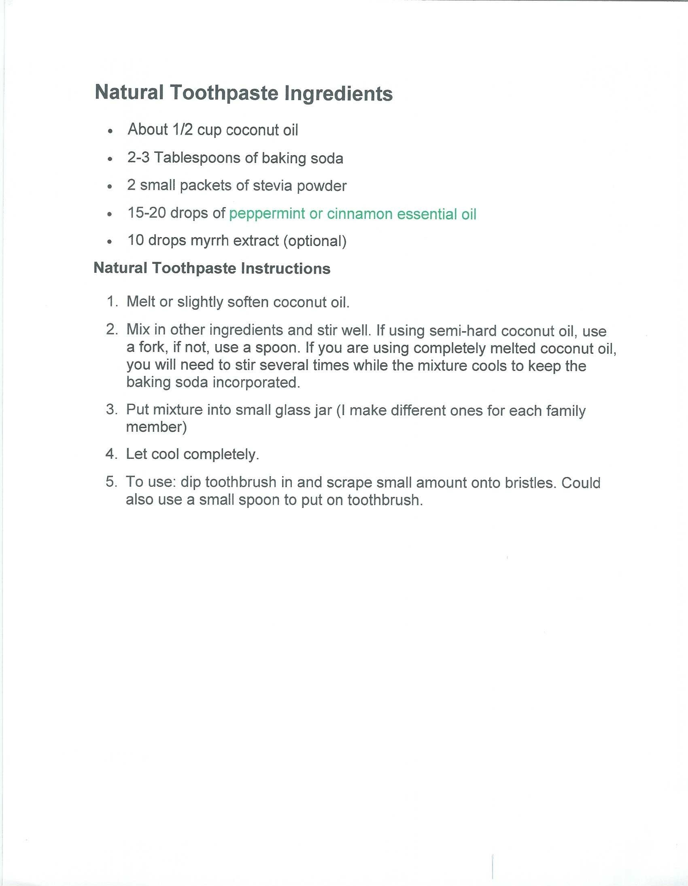

---
title: NATURAL TOOTHPASTE
sidebar_label: NATURAL TOOTHPASTE
---

# NATURAL TOOTHPASTE

Natural Toothpaste Ingredients
•	About 1/2 cup coconut oil
•	2-3 Tablespoons of baking soda
•	2 small packets of stevia powder
•	15-20 drops of peppermint or cinnamon essential oil
•	10 drops myrrh extract (optional)
Natural Toothpaste Instructions
1.	Melt or slightly soften coconut oil.
2.	Mix in other ingredients and stir well. If using semi-hard coconut oil, use a fork, if not, use a spoon. If you are using completely melted coconut oil, you will need to stir several times while the mixture cools to keep the baking soda incorporated.
3.	Put mixture into small glass jar (I make different ones for each family member)
4.	Let cool completely.
5.	To use: dip toothbrush in and scrape small amount onto bristles. Could also use a small spoon to put on toothbrush.

